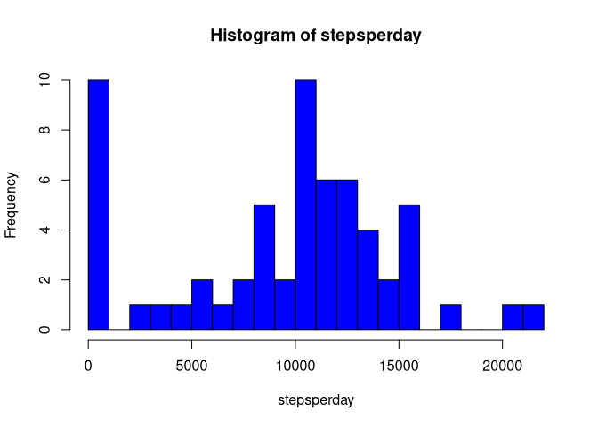
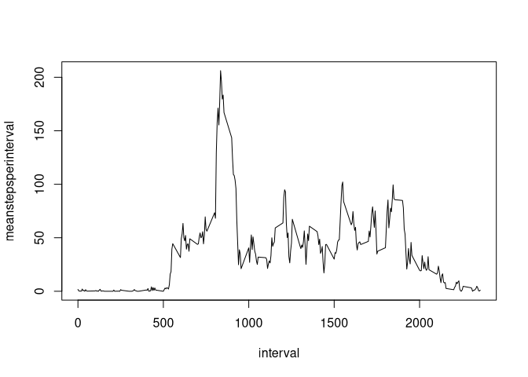
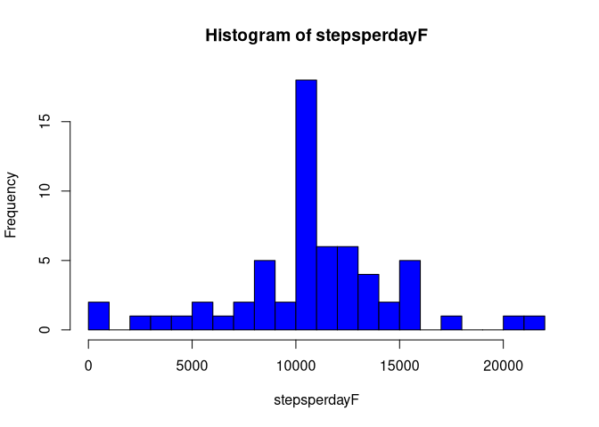
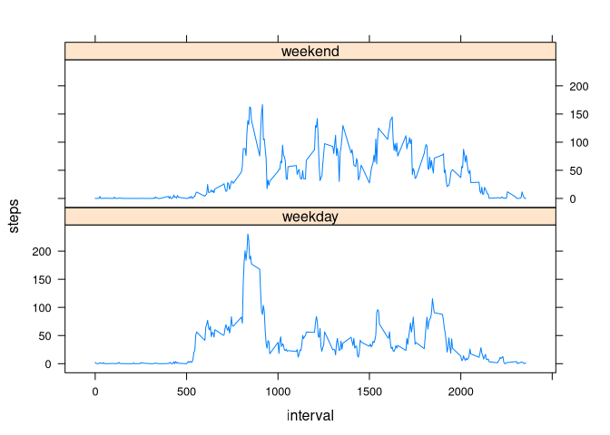

## Setup

```r
knitr::opts_chunk$set(echo=T)
```

## Loading librarys

```r
library(tidyverse)
```

```
## ── Attaching packages ─────────────────────────────────────────────────────────────────────────────────────────────── tidyverse 1.3.0 ──
```

```
## ✓ ggplot2 3.3.2     ✓ purrr   0.3.4
## ✓ tibble  3.0.3     ✓ dplyr   1.0.2
## ✓ tidyr   1.1.2     ✓ stringr 1.4.0
## ✓ readr   1.3.1     ✓ forcats 0.5.0
```

```
## ── Conflicts ────────────────────────────────────────────────────────────────────────────────────────────────── tidyverse_conflicts() ──
## x dplyr::filter() masks stats::filter()
## x dplyr::lag()    masks stats::lag()
```

```r
library(lattice)
```


## Loading and preprocessing the data
firstly we will unzip the file, read its content and save in 
a variable


```r
unzip("activity.zip", overwrite = F)
```

```
## Warning in unzip("activity.zip", overwrite = F): not overwriting file './
## activity.csv
```

```r
activity <- read.csv("activity.csv")
```


## What is mean total number of steps taken per day?


```r
stepsperday <- tapply(activity$steps,activity$date, sum, na.rm=T)
hist(stepsperday, breaks = 20, col='blue')
```

<!-- -->

```r
meansteps <- mean(stepsperday, na.rm=T)

mediansteps <- median(stepsperday, na.rm=T)
```
the mean of the total steps taken per day was 9354.23 steps, while the
median was 10395 steps.


## What is the average daily activity pattern?

```r
meanstepsperinterval <- tapply(activity$steps,activity$interval, mean, na.rm=T)
interval <- unique(activity$interval)
plot(interval, meanstepsperinterval, type='l')
```

<!-- -->

```r
maxmeansteps <- interval[which.max(meanstepsperinterval)]
```
The interval where occured the most number of steps was in the 835 
interval.               


## Imputing missing values

```r
isamissingvalue <- is.na(activity$steps)
missingvalues <- sum(isamissingvalue)
```
The dataframe contains 2304 missing values.

The following code is a strategy to fulfill the NA values using the mean in the 
corresponding interval. I preferred this strategy because it avoids days without
 any registration.


```r
newsteps <- numeric(length = length(isamissingvalue))
for (i in 1:length(newsteps)){
        newsteps[i] <- if(isamissingvalue[i]==F){
                activity$steps[i]
        }
        else{
                if(i%%288==0)
                        meanstepsperinterval[288]
                else
                        meanstepsperinterval[i%%288]
        }
}
```
Creating the new dataset:

```r
activityFilled <- activity
activityFilled$steps <- newsteps
```


```r
stepsperdayF <- tapply(activityFilled$steps,activityFilled$date, sum, na.rm=T)
hist(stepsperdayF, breaks = 20, col='blue')
```

<!-- -->

```r
meanstepsF <- mean(stepsperdayF, na.rm=T)

medianstepsF <- median(stepsperdayF, na.rm=T)
```

the mean of the total steps taken per day after fulfilling the NA data
was 10766.19 steps, while the median was 10766.19 steps.

This differs from the original data by:

+ in mean: 1411.959171

+ in median: 371.1886792


## Are there differences in activity patterns between weekdays and weekends?

Creating the factor


```r
# firstly we will create a vector with all weekdays
activityWeekdays <- weekdays(as.Date(activityFilled$date))
# now the factor:
weekdayWeekend <- factor(ifelse(activityWeekdays %in% c("Saturday", "Sunday"), "weekend", "weekday"))
```
Now we will agregate to the data frame


```r
activityFilled$weekday <- weekdayWeekend
```

```r
meanstepsperweekday <- tapply(activityFilled$steps,list(activityFilled$interval,activityFilled$weekday), mean, na.rm=T)
dim(meanstepsperweekday) <- c(576,1)
df <- data_frame(rep(interval, 2), meanstepsperweekday, c(rep("weekday", 288), rep("weekend",288)))
```

```
## Warning: `data_frame()` is deprecated as of tibble 1.1.0.
## Please use `tibble()` instead.
## This warning is displayed once every 8 hours.
## Call `lifecycle::last_warnings()` to see where this warning was generated.
```

```r
names(df) <- c("interval", "steps", "week")
```

Now lets plot:

```r
xyplot(steps ~ interval | week, data=df, type='l', layout=c(1,2))
```

<!-- -->


